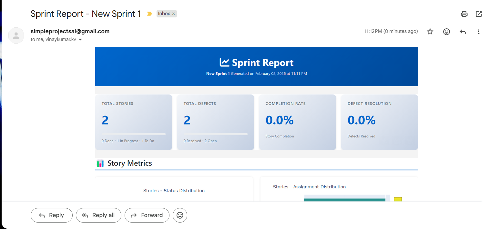

# JIRA Sprint Reporter - Enhanced Email Version

**Comprehensive sprint reporting tool with automated email delivery and visual analytics**

Generate beautiful, interactive HTML reports from your JIRA sprints and automatically deliver them via email with embedded screenshots. Perfect for daily standups, sprint reviews, and stakeholder updates.

---

## 📋 Table of Contents

- [Features](#-features)
- [Requirements](#-requirements)
- [Installation](#-installation)
- [Configuration](#-configuration)
- [Usage](#-usage)
- [Output](#-output)
- [Troubleshooting](#-troubleshooting)
- [API Integrations](#-api-integrations)
- [Future Enhancements](#-future-enhancements)
- [Contributing](#-contributing)
- [License](#-license)

---

## ✨ Features

### Core Functionality
- ✅ **JIRA Agile API Integration** - Fetches sprint data using rest/agile/1.0/ endpoints
- ✅ **Automated Email Delivery** - Sends reports via Outlook (Windows) or SMTP
- ✅ **Screenshot Capture** - Headless browser screenshots using Playwright
- ✅ **Interactive Visualizations** - Charts and graphs using Plotly
- ✅ **Data Export** - CSV files for stories and defects

### Report Contents
- 📊 **Summary Dashboard** - Key metrics and completion rates
- 📈 **Story Analytics** - Status distribution, assignee workload
- 🐛 **Defect Tracking** - Priority breakdown, resolution rates
- 📝 **Detailed Tables** - Sortable, filterable DataTables
- 🎨 **Professional Design** - Modern, responsive HTML/CSS

### Email Features
- 📧 **Embedded Images** - Screenshots embedded directly in email body
- 🖼️ **Optimized for Email** - Resized images for faster delivery
- 📱 **Mobile-Friendly** - Responsive table-based layout
- 🔄 **Dual Delivery** - Supports both Outlook and SMTP


---

## 💻 Requirements

### System Requirements
- **Python**: 3.8 or higher
- **Operating System**: Windows (for Outlook), Linux/macOS (SMTP only)
- **Browser**: Chromium (auto-installed by Playwright)

### JIRA Requirements
- Active JIRA account with API access
- Board ID and Sprint ID
- API token generated

### Network Requirements
- Access to JIRA instance (cloud or self-hosted)
- SMTP server access (if not using Outlook)
- Internet connection for dependency installation

---

## 🔧 Installation

### Step 1: Clone or Download

```bash
# Clone repository (if using git)
git clone https://github.com/yourcompany/jira-sprint-reporter.git
cd jira-sprint-reporter

# Or download and extract ZIP file
```

### Step 2: Create Virtual Environment (Recommended)

```bash
# Create virtual environment
python -m venv venv

# Activate virtual environment
# Windows:
venv\Scripts\activate
# Linux/macOS:
source venv/bin/activate
```

### Step 3: Install Dependencies

```bash
# Install Python packages
pip install -r requirements.txt

# Install Playwright browsers
playwright install chromium

# For Windows Outlook support (optional)
pip install pywin32
```

### Step 4: Verify Installation

```bash
# Check Python version
python --version  # Should be 3.8+

# Verify Playwright
playwright --version

# Test imports
python -c "import pandas, plotly, playwright; print('✓ All imports successful')"
```

---

## ⚙️ Configuration

### Step 1: Create Environment File

```bash
# Copy template
cp .env_template .env

# Edit with your favorite editor
notepad .env  # Windows
nano .env     # Linux/macOS
```

### Step 2: Configure JIRA Settings

#### Find Your Board ID
1. Navigate to your JIRA board
2. Look at the URL: `https://yourcompany.atlassian.net/secure/RapidBoard.jspa?rapidView=123`
3. The number after `rapidView=` is your Board ID (123)

#### Find Your Sprint ID

**Method 1: Using JIRA API Browser**
1. Go to: `https://yourcompany.atlassian.net/rest/agile/1.0/board/{YOUR_BOARD_ID}/sprint`
2. Find your active sprint in the JSON response
3. Copy the `id` field

**Method 2: Using Browser DevTools**
1. Open your sprint in JIRA
2. Open browser DevTools (F12)
3. Go to Network tab
4. Refresh page
5. Look for API calls containing `/sprint/`
6. Find the sprint ID in the URL

**Method 3: Run with Any ID (Quick Test)**
1. Use any sprint ID temporarily
2. Run the script
3. Check the error message - it will show available sprint IDs

#### Generate API Token
1. Go to: https://id.atlassian.com/manage-profile/security/api-tokens
2. Click "Create API token"
3. Give it a name (e.g., "Sprint Reporter")
4. Copy the token immediately (you won't see it again)
5. Paste into `JIRA_API_KEY` in .env file

### Step 3: Configure Email Settings

#### Option A: Using Outlook (Windows Only)

```env
EMAIL_RECIPIENTS=manager@company.com,team@company.com
EMAIL_CC_RECIPIENTS=stakeholder@company.com

# SMTP settings can be left empty
SMTP_SERVER=
SMTP_PORT=
EMAIL_USER=
EMAIL_PASSWORD=
```

#### Option B: Using SMTP (All Platforms)

**Gmail Example:**
```env
EMAIL_RECIPIENTS=manager@company.com,team@company.com
SMTP_SERVER=smtp.gmail.com
SMTP_PORT=587
EMAIL_USER=your.email@gmail.com
EMAIL_PASSWORD=your_app_specific_password
```

**Generate Gmail App Password:**
1. Enable 2FA: https://myaccount.google.com/security
2. Generate app password: https://myaccount.google.com/apppasswords
3. Use app password (not regular password)

**Office 365 Example:**
```env
SMTP_SERVER=smtp.office365.com
SMTP_PORT=587
EMAIL_USER=your.email@company.com
EMAIL_PASSWORD=your_password
```

### Step 4: Customize Issue Types (Optional)

```env
# Customize what counts as "Stories"
STORY_TYPES=Story,Task,Epic,Initiative

# Customize what counts as "Defects"
DEFECT_TYPES=Bug,Defect,Escaped Defect,Production Issue,Incident
```

---

## 🚀 Usage

### Basic Usage

```bash
# Activate virtual environment (if not already active)
source venv/bin/activate  # Linux/macOS
venv\Scripts\activate     # Windows

# Run the reporter
python jira_sprint_reporter.py
```

### Expected Output

```
============================================================
JIRA Sprint Reporter - Enhanced Email Version
============================================================
Loading configuration...
Sprint: Sprint 24 - Q1 2024
Project: YOURPROJECT
Initializing JIRA client...
Fetching sprint issues...
Fetched 45/45 issues
Total sprint issues fetched: 45
Parsing issues...
Stories: 35
Defects: 10
Stories exported to CSV
Defects exported to CSV
Generating HTML report...
✓ HTML report: sprint_report.html
============================================================
Preparing email version with screenshots...
============================================================
Starting screenshot capture...
Capturing header...
  ✓ Saved: header.png
Capturing summary section...
  ✓ Saved: summary.png
Capturing story charts...
  ✓ Saved: story_charts.png
Capturing defect charts...
  ✓ Saved: defect_charts.png
Captured 6 screenshots
Resizing images for email...
  ✓ Resized: header
  ✓ Resized: summary
  ✓ Resized: story_charts
  ✓ Resized: defect_charts
Building email-friendly HTML...
Creating Outlook email...
  ✓ Attached: header.png as CID:<header>
  ✓ Attached: summary.png as CID:<summary>
✓ Email sent successfully
============================================================
JIRA Sprint Reporter - Completed
============================================================
```

### Running Manually

```bash
# Run without email (just generate HTML)
# Set EMAIL_RECIPIENTS= (empty) in .env

# Run with specific Python version
python3.10 jira_sprint_reporter.py

# Run with debugging
python -u jira_sprint_reporter.py 2>&1 | tee output.log
```

### Scheduling Automated Reports

#### Windows Task Scheduler

1. Open Task Scheduler
2. Create Basic Task
3. Name: "JIRA Sprint Report"
4. Trigger: Daily at 9:00 AM
5. Action: Start a program
   - Program: `C:\path\to\venv\Scripts\python.exe`
   - Arguments: `C:\path\to\jira_sprint_reporter.py`
   - Start in: `C:\path\to\project`

#### Linux/macOS Cron

```bash
# Edit crontab
crontab -e

# Add daily run at 9 AM
0 9 * * * cd /path/to/project && /path/to/venv/bin/python jira_sprint_reporter.py >> /path/to/logs/sprint_report.log 2>&1
```

#### Using Python Scheduler

```python
# schedule_reporter.py
import schedule
import time
import subprocess

def run_report():
    subprocess.run(["python", "jira_sprint_reporter.py"])

schedule.every().day.at("09:00").do(run_report)

while True:
    schedule.run_pending()
    time.sleep(60)
```

---

## 📊 Output

### Generated Files

```
project/
├── sprint_report.html              # Interactive HTML report
├── sprint_stories.csv              # Stories data export
├── sprint_defects.csv              # Defects data export
├── report_screenshots/             # Original screenshots
│   ├── header.png
│   ├── summary.png
│   ├── story_charts.png
│   ├── defect_charts.png
│   ├── stories_table.png
│   └── defects_table.png
└── report_screenshots_resized/     # Email-optimized images
    ├── header.png
    ├── summary.png
    └── ...
```

### HTML Report Features

- **Interactive Charts**: Click, zoom, hover for details
- **Sortable Tables**: Click column headers to sort
- **Searchable**: Filter records in real-time
- **Responsive**: Works on desktop, tablet, mobile
- **Print-Friendly**: Clean layout for printing

### Email Report Features

- **Embedded Screenshots**: No external image hosting needed
- **Table-Based Layout**: Maximum email client compatibility
- **Optimized Images**: Resized for faster loading
- **Professional Formatting**: Corporate-friendly appearance

---

## 🔍 Troubleshooting

### Common Issues

#### 1. Missing Environment Variables

**Error:**
```
ConfigurationError: Missing required environment variables: JIRA_API_KEY, JIRA_SPRINT_ID
```

**Solution:**
- Check that `.env` file exists in project root
- Verify all required variables are set
- Ensure no quotes around values
- Run `python -c "from dotenv import load_dotenv; load_dotenv(); import os; print(os.getenv('JIRA_BASE_URL'))"`

#### 2. JIRA Authentication Failed

**Error:**
```
Error fetching issues: 401 Unauthorized
```

**Solution:**
- Verify JIRA_USERNAME is your email
- Check API token is valid and not expired
- Regenerate API token if needed
- Test with curl:
  ```bash
  curl -u your.email@company.com:your_api_token \
    https://yourcompany.atlassian.net/rest/agile/1.0/sprint/123
  ```

#### 3. Sprint Not Found

**Error:**
```
Error fetching issues: 404 Not Found
```

**Solution:**
- Verify JIRA_SPRINT_ID is correct
- Check JIRA_BOARD_ID matches the sprint
- List available sprints:
  ```bash
  curl -u email:token \
    https://yourcompany.atlassian.net/rest/agile/1.0/board/YOUR_BOARD_ID/sprint
  ```

#### 4. Playwright Not Installed

**Error:**
```
ImportError: Playwright not installed
```

**Solution:**
```bash
pip install playwright
playwright install chromium

# If still failing, try:
playwright install-deps  # Linux only
```

#### 5. Chromium Download Failed

**Error:**
```
Failed to launch browser: Executable doesn't exist
```

**Solution:**
```bash
# Check Playwright browsers
playwright install --help

# Manually specify Chromium path in .env:
CHROMIUM_PATH=/usr/bin/chromium-browser  # Linux
CHROMIUM_PATH=C:\Program Files\Google\Chrome\Application\chrome.exe  # Windows
```

#### 6. Outlook Email Failed

**Error:**
```
pywintypes.com_error: (-2147352567, 'Exception occurred.', ...)
```

**Solution:**
- Ensure Outlook is installed and configured
- Try opening Outlook manually first
- Check that Outlook is set as default mail client
- Verify pywin32 is installed: `pip install pywin32`
- Run: `python Scripts/pywin32_postinstall.py -install` (Windows)

#### 7. SMTP Authentication Failed

**Error:**
```
SMTPAuthenticationError: (535, b'5.7.8 Username and Password not accepted')
```

**Solution:**
- For Gmail: Use app-specific password, not regular password
- For Office 365: Enable basic authentication if disabled
- Verify SMTP server and port are correct
- Test SMTP connection:
  ```python
  import smtplib
  server = smtplib.SMTP('smtp.gmail.com', 587)
  server.starttls()
  server.login('your.email@gmail.com', 'your_app_password')
  print("✓ SMTP connection successful")
  ```

#### 8. Memory Issues with Large Sprints

**Error:**
```
MemoryError: Unable to allocate array
```

**Solution:**
- Reduce SCREENSHOT_WIDTH in .env (try 1200 or 1000)
- Process stories and defects separately
- Increase Python memory limit
- Use pagination for very large sprints

### Debug Mode

Enable detailed logging:

```python
# Add to jira_sprint_reporter.py (top of file)
logging.basicConfig(
    level=logging.DEBUG,  # Changed from INFO
    format='%(asctime)s - %(name)s - %(levelname)s - %(message)s'
)
```

Or run with Python verbose mode:
```bash
python -v jira_sprint_reporter.py
```

### Getting Help

1. **Check Logs**: Review console output for specific error messages
2. **Test Components**: Isolate issues (JIRA connection, screenshots, email)
3. **Verify Configuration**: Double-check all .env variables
4. **Update Dependencies**: `pip install --upgrade -r requirements.txt`
5. **Create Issue**: Submit bug report with logs and configuration (remove sensitive data)

---

## 🔗 API Integrations & Resources

### JIRA API Documentation

- **Agile REST API**: https://docs.atlassian.com/jira-software/REST/latest/
- **Core REST API**: https://developer.atlassian.com/cloud/jira/platform/rest/v3/
- **Authentication**: https://developer.atlassian.com/cloud/jira/platform/basic-auth-for-rest-apis/
- **API Tokens**: https://id.atlassian.com/manage-profile/security/api-tokens

### Useful JIRA API Endpoints

```bash
# List all boards
GET /rest/agile/1.0/board

# List sprints for a board
GET /rest/agile/1.0/board/{boardId}/sprint

# Get sprint issues
GET /rest/agile/1.0/sprint/{sprintId}/issue

# Get issue details
GET /rest/api/3/issue/{issueKey}

# Search issues with JQL
POST /rest/api/3/search
{
  "jql": "project = PROJ AND sprint = 123",
  "fields": ["summary", "status", "assignee"]
}
```

### Integration Examples

#### Slack Integration

```python
# Add to your script
import requests

def send_slack_notification(webhook_url, sprint_name, stats):
    message = {
        "text": f"📊 Sprint Report Ready: {sprint_name}",
        "blocks": [
            {
                "type": "section",
                "text": {
                    "type": "mrkdwn",
                    "text": f"*Stories*: {stats['total_stories']} ({stats['stories_done']} done)\n*Defects*: {stats['total_defects']} ({stats['defects_resolved']} resolved)"
                }
            }
        ]
    }
    requests.post(webhook_url, json=message)
```

#### Microsoft Teams Integration

```python
def send_teams_notification(webhook_url, report_url, stats):
    message = {
        "@type": "MessageCard",
        "summary": "Sprint Report Available",
        "sections": [{
            "activityTitle": "Sprint Report Generated",
            "facts": [
                {"name": "Total Stories", "value": str(stats['total_stories'])},
                {"name": "Stories Completed", "value": str(stats['stories_done'])},
                {"name": "Defects Resolved", "value": str(stats['defects_resolved'])}
            ]
        }],
        "potentialAction": [{
            "@type": "OpenUri",
            "name": "View Report",
            "targets": [{"os": "default", "uri": report_url}]
        }]
    }
    requests.post(webhook_url, json=message)
```

#### Confluence Integration

```python
# Publish report to Confluence
from atlassian import Confluence

def publish_to_confluence(html_content, space_key, parent_page_id):
    confluence = Confluence(
        url='https://yourcompany.atlassian.net',
        username=os.getenv('JIRA_USERNAME'),
        password=os.getenv('JIRA_API_KEY')
    )
    
    title = f"Sprint Report - {datetime.now().strftime('%Y-%m-%d')}"
    
    confluence.create_page(
        space=space_key,
        title=title,
        body=html_content,
        parent_id=parent_page_id
    )
```

### Third-Party Tools

- **Postman Collections**: https://www.postman.com/atlassian/workspace/atlassian-public/
- **JIRA Python SDK**: https://jira.readthedocs.io/
- **Playwright Docs**: https://playwright.dev/python/
- **Plotly Examples**: https://plotly.com/python/

---

## 🚀 Future Enhancements

### Planned Features

#### Short-term (Next Release)
- [ ] **Multi-Sprint Comparison** - Compare current vs previous sprints
- [ ] **Velocity Tracking** - Calculate and visualize team velocity
- [ ] **Burndown Charts** - Sprint burndown visualization
- [ ] **Custom Themes** - Configurable color schemes and branding
- [ ] **PDF Export** - Generate PDF version of reports
- [ ] **Dashboard Mode** - Real-time dashboard for TVs/monitors

#### Medium-term
- [ ] **Historical Trending** - Track metrics over multiple sprints
- [ ] **Team Performance Metrics** - Individual and team analytics
- [ ] **Automated Insights** - AI-powered sprint analysis
- [ ] **Mobile App** - Native iOS/Android apps
- [ ] **Webhook Support** - Trigger reports via webhooks
- [ ] **Custom Queries** - Advanced JQL query support

#### Long-term
- [ ] **Multi-Project Reports** - Aggregate across projects
- [ ] **Predictive Analytics** - Forecast sprint completion
- [ ] **Integration Hub** - Pre-built integrations (Slack, Teams, etc.)
- [ ] **Custom Widgets** - Drag-and-drop report builder
- [ ] **API Server** - RESTful API for programmatic access
- [ ] **Cloud Hosting** - SaaS version with no installation

### Enhancement Ideas

#### Data & Analytics
```python
# Proposed: Velocity calculation
def calculate_velocity(sprint_ids: List[int]) -> Dict:
    """Calculate average velocity over multiple sprints"""
    velocities = []
    for sprint_id in sprint_ids:
        issues = fetch_sprint_issues(sprint_id)
        story_points = sum(i['story_points'] for i in issues)
        velocities.append(story_points)
    
    return {
        'average': statistics.mean(velocities),
        'trend': 'increasing' if velocities[-1] > velocities[0] else 'decreasing',
        'history': velocities
    }
```

#### Custom Reporting
```python
# Proposed: Template system
def apply_custom_template(data: Dict, template_name: str) -> str:
    """Apply custom Jinja2 template to report data"""
    from jinja2 import Template
    
    template = Template(open(f'templates/{template_name}.html').read())
    return template.render(**data)
```

#### Advanced Filtering
```python
# Proposed: Dynamic filtering
class ReportFilter:
    def __init__(self):
        self.filters = []
    
    def add_filter(self, field: str, operator: str, value: Any):
        self.filters.append({
            'field': field,
            'operator': operator,
            'value': value
        })
    
    def apply(self, df: pd.DataFrame) -> pd.DataFrame:
        for f in self.filters:
            if f['operator'] == 'equals':
                df = df[df[f['field']] == f['value']]
            elif f['operator'] == 'contains':
                df = df[df[f['field']].str.contains(f['value'])]
        return df
```

### Contributing Ideas

We welcome contributions! Here are some areas where you can help:

1. **Bug Fixes**: Report or fix issues
2. **New Features**: Implement features from roadmap
3. **Documentation**: Improve docs, add examples
4. **Testing**: Add unit tests, integration tests
5. **Integrations**: Build connectors to other tools
6. **UI/UX**: Enhance report design and usability

See [CONTRIBUTING.md](CONTRIBUTING.md) for guidelines.

---

## 📝 Best Practices

### Security
- Never commit `.env` file
- Rotate API tokens regularly (every 90 days)
- Use app-specific passwords for email
- Limit email recipients to need-to-know basis
- Review permissions on JIRA API token

### Performance
- Run during off-peak hours for large sprints
- Use caching for frequently accessed data
- Optimize screenshot resolution based on needs
- Consider archiving old reports

### Maintenance
- Update dependencies monthly: `pip install --upgrade -r requirements.txt`
- Review JIRA API changes
- Test email delivery regularly
- Monitor report generation time
- Keep Playwright browsers updated: `playwright install --force`

### Troubleshooting Workflow
1. Check logs for specific error messages
2. Verify .env configuration
3. Test JIRA connection independently
4. Test email delivery separately
5. Isolate screenshot generation
6. Review recent code changes

---

## 📄 License

This project is licensed under the MIT License - see [LICENSE](LICENSE) file for details.

---

## 🙏 Acknowledgments

- **Atlassian** - JIRA Agile API
- **Plotly** - Interactive visualizations
- **Playwright** - Browser automation
- **Pandas** - Data manipulation
- **Community** - Contributors and testers

---

## 📞 Support

- **Issues**: https://github.com/vinaykumarkv/jira-sprint-reporter/issues
- **Discussions**: https://github.com/vinaykumarkv/jira-sprint-reporter/discussions
- **Email**: vinaykumar.kv@outlook.com
- **Wiki**: https://github.com/vinaykumarkv/jira-sprint-reporter/wiki


